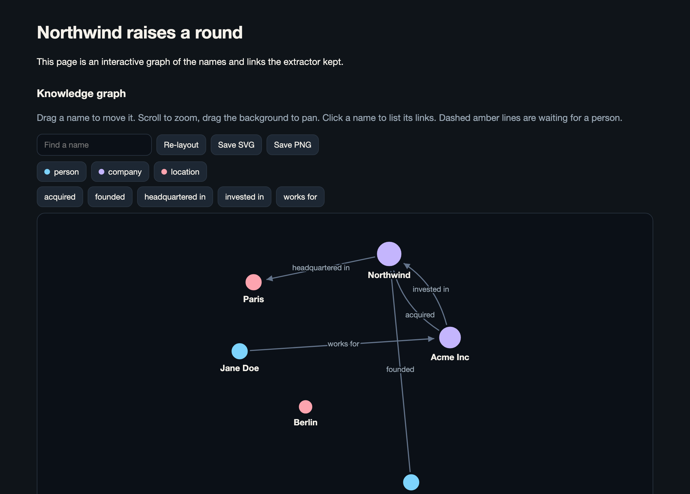
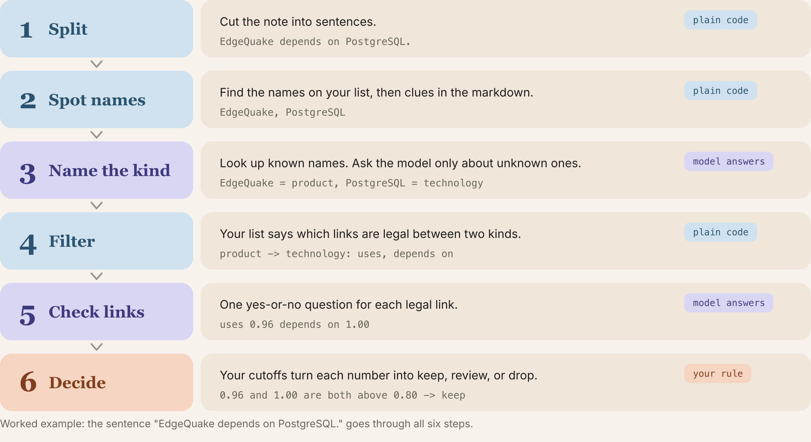

# edgextract

**Turn markdown into a knowledge graph with an ontology you write and a cutoff you own.**

Your code proposes names. Your ontology says which kinds and links are legal. A small local decision model answers one closed yes-or-no question at a time. Anything it is unsure about waits for a person instead of silently entering your graph.



<sub>Real output from a local `tev1` run on [`13_northwind.md`](data/golden/docs/13_northwind.md): [open the interactive page](docs/article/sample-graph.html) · [full report](docs/article/sample-report.html) · [read the article (PDF)](docs/article/article.pdf). One of the five links in that graph is wrong (`Acme ACQUIRED Northwind`; the text says "invested in"). We left it in. That is what the review queue and your cutoff are for.</sub>

## 60-second start

```bash
git clone https://github.com/raphaelmansuy/edgextract && cd edgextract
uv sync --all-extras
ollama pull tev1                       # a local decision model (Ollama 0.35+)
uv run edgextract --model tev1 report data/golden/docs/13_northwind.md \
    --ontology company_news --out graph.html
open graph.html
```

No model yet? Everything below runs offline against a stand-in model:

```bash
make test examples
```

Or from Python, in five lines:

```python
from edgextract import extract_text, load_ontology_named, write_report

text = open("note.md").read()
ontology = load_ontology_named("company_news")      # or "tech_docs", "conll04", or a YAML path
result = extract_text(text, ontology, model="tev1")
write_report("graph.html", text, result, ontology, title="My note")
```

## Why not just ask a chat model for JSON?

A chat model writes the next token. A JSON schema makes the output *well-formed*. It does not make it *true*, and it does not tell you how sure the model was. You parse, repair, and hope.

edgextract asks a different question. For every candidate pair it sends a closed yes-or-no to Ollama's `POST /v1/systemone` and gets back a probability. Your cutoff then decides: **keep**, **send to a person**, or **drop**.

We measured it on [CoNLL04](https://github.com/lavis-nlp/spert), a standard news benchmark (288 test sentences, exact-span scoring, none of the names pre-listed). Same scorer for every row. The first run used a smaller name finder and scored slightly higher on links; we publish both and use the final, shipped configuration as the number of record.

| Method | Names F1 | Links F1 | Trained on CoNLL04? |
|---|---|---|---|
| SpERT (published) | 0.889 | 0.715 | yes |
| edgextract + `tev1`, final run | 0.690 | 0.388 | no |
| edgextract + `tev1`, first run | 0.658 | 0.411 | no |
| Mistral Small, JSON per sentence | 0.643 | 0.330 | no |

**Read this table honestly.** A model trained on the benchmark's own training sentences still wins by a wide margin. The comparison that matters is the zero-shot rows. There, the closed decision keeps far fewer wrong links than the chat model (links precision 0.41 against 0.27; 218 wrong links kept against 504) and gives up some recall for it. Name scores on that test are close (0.690 against 0.643). On the twelve tech notes they are not: `tev1` scores 0.97, mostly because the names are already on the list, and Mistral Small scored 0.68 on the saved run (0.80 on an earlier run the same day). See the [full evaluation](specs/0001-implementation/14-evaluation.md).

## How it works



1. Split markdown into sentences with character offsets.
2. Propose names: the ontology's listed names, markdown cues, and optionally a span finder (GLiNER).
3. Type each name by lookup. For an unknown span, ask yes-or-no ("is this a name?"), then pick one kind from your list.
4. Drop pairs your ontology does not allow. Illegal links are never asked.
5. Ask one yes-or-no per legal link type, so "uses" and "depends on" can both be true.
6. Keep, review, or drop using cutoffs in your code.

The model never finds a span and never invents a type.

## Write your own ontology

```bash
uv run edgextract init-ontology my_domain.yaml       # a commented starter
uv run edgextract validate-ontology my_domain.yaml   # prints kinds and legal links in plain words
```

```yaml
id: company_news
types:
  - {id: PERSON,  description: A named person (founder, executive, investor).}
  - {id: COMPANY, description: A named company, startup, or fund.}
relations:
  - id: FOUNDED
    description: The person founded the company.
    domain: [PERSON]
    range: [COMPANY]
gazetteer:            # optional: names you already know
  Ada Lovelace: PERSON
```

## Learn by example

Nine short scripts, each one idea. See [`examples/README.md`](examples/README.md).

| | |
|---|---|
| `01_hello_decision` | One closed question and its probability |
| `02_pick_a_label` | Yes-or-no and a scored level |
| `03_type_a_name` | Looking up and typing names |
| `04_find_links` | One yes-or-no per legal link |
| `05_extract_a_document` | The whole pipeline |
| `06_review_queue` | Uncertain items, written as sentences |
| `07_your_own_ontology` | Company news instead of software docs |
| `08_compare_with_chat_model` | Decision model against chat JSON |
| `09_export_graph` | JSON, Cypher, interactive HTML |

## Output

EdgeQuake-shaped JSON: entities with canonical `UPPER_SNAKE` names and kinds, relationships with the evidence sentence, a `review` list for uncertain items, and a `rejected` list. `edgextract export-cypher` prints Cypher; `edgextract graph` writes the interactive page.

## Honest limits

- **The cutoffs are not calibrated.** `GateConfig.fitted` starts false. Fit them on your labels with `edgextract calibrate`. We do not claim anything about hosted-Jev calibration.
- **Pronouns are skipped.** There is no coreference and links do not cross sentences in this version.
- **Direction can flip.** On CoNLL04 the final run kept 16 reversed links (9 in the first run). On the EdgeQuake sample the model kept "Nimble uses Ollama" at 0.85, and the answer key says the other direction.
- **`weight` is the model's probability.** The cutoff compares that number. It is not a rescaled score.
- **It needs Ollama 0.35+ with a decision model.** On one seven-sentence note, an earlier comparison took 7.9 s for `tev1` and 77.8 s for `gemma4` on the same computer, and 3.9 s for hosted Mistral. A later `tev1` pass with the model already loaded took 4.3 s. The library default model is `nimble`, which scored 0.38 on links for that note. The published CoNLL04 run used `tev1` and the larger name finder, which `edgextract report` does not load unless you run `eval-benchmark`.
- **A trained joint model beats it** if you have labeled sentences in your domain.
- `format`/JSON-schema on a chat host is not a decision. Do not call it one.

## Roadmap

- Fit and ship per-ontology cutoffs from labeled data
- Cross-sentence links with a bounded window
- Optional pronoun resolution
- A Rust binding for EdgeQuake ingest

## Learn more

- [The article](docs/article/article.md) ([PDF](docs/article/article.pdf)): the problem, the idea, and the measured results in plain English
- [Spec pack](specs/0001-implementation/): requirements, contract, evaluation
- [Contributing](CONTRIBUTING.md) · [Code of conduct](CODE_OF_CONDUCT.md) · [Apache-2.0](LICENSE)

EdgeQuake was the inspiration for the output shape. edgextract is an independent Python library.

By [Raphael MANSUY](https://www.linkedin.com/in/raphaelmansuy/).
