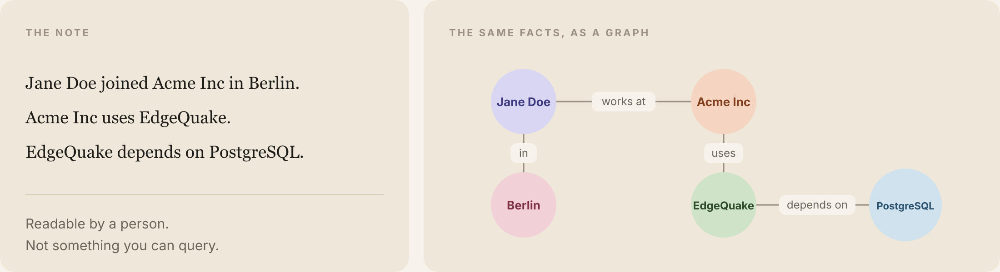
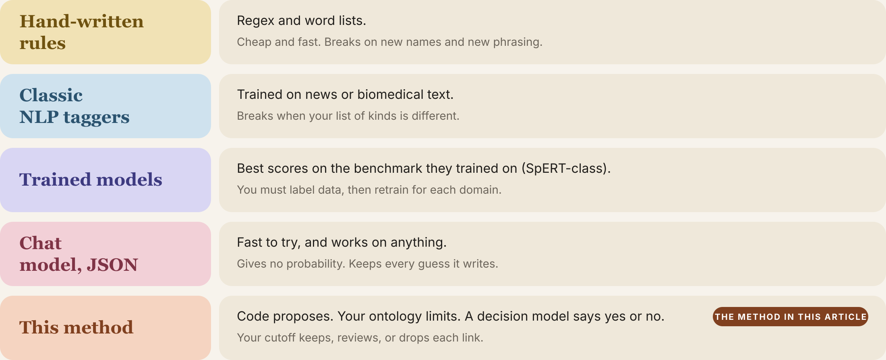
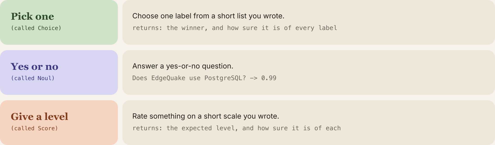
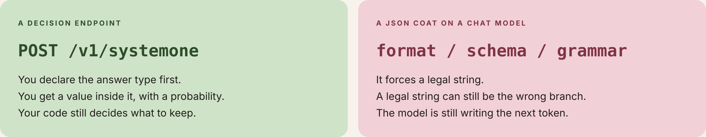
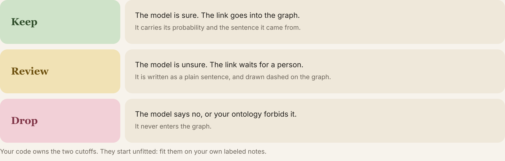
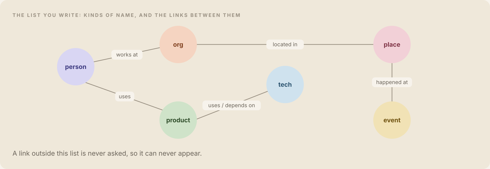
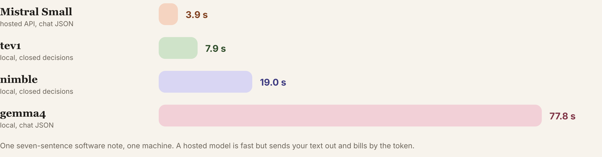
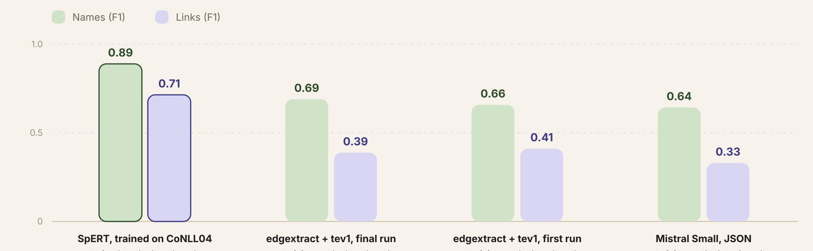
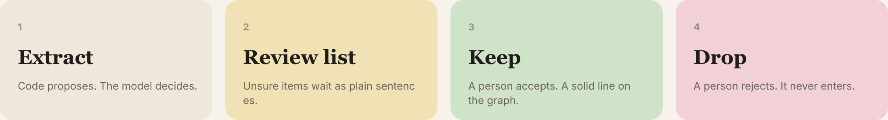
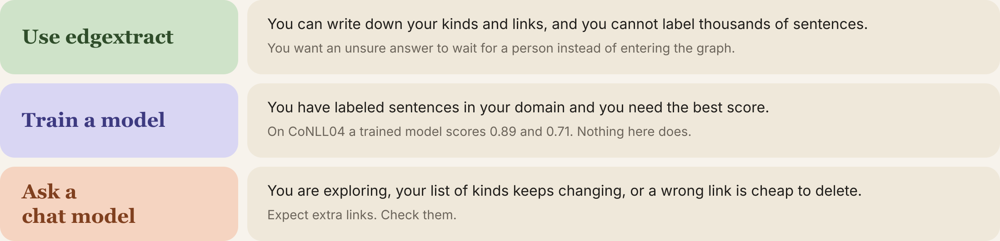

# The problem, in one minute

A person can read the note below and answer "Who works where?" A computer cannot. The facts are buried in the sentences.

> Jane Doe joined Acme Inc in Berlin. Acme Inc uses EdgeQuake. EdgeQuake depends on PostgreSQL.

A **knowledge graph** is those facts pulled out: the people, companies, products, and places, and the links between them ("works at", "uses", "depends on"). Once they are a graph, you can ask "Who works at Acme?" or "Which products depend on PostgreSQL?" across a thousand files.

Pulling the links out of the text is called **extraction**. Most tools ask a chat model to write the whole graph. This one asks one yes-or-no question per link, keeps the number the model returns, and lets your code decide what is sure enough to keep.



# Why it is hard to do well today

There are five common ways to do it. Each one gives something up.



**Rules** (word lists and search patterns) are cheap, and they break as soon as a sentence is phrased a new way. **Older trained tools** work on the kind of text they were trained on, usually news, and fail when your list of kinds is different. **Newer trained models** score highest, after someone labels thousands of examples for your topic.

The popular shortcut is a **chat model** writing JSON, a tidy format programs can read. It works on almost any topic and takes ten minutes to try. A tidy answer can still be the wrong answer. The model is writing the next word. It does not hand you a number, so a guess looks like a fact, and someone has to read every link.

# The idea: ask small questions, get a number

A **decision model** does not write. It answers one **closed question**: you decide the shape of the answer before it runs. The small models used here are the kind people call **Jev-style**. There are three shapes.



The answer always comes with a number between 0 and 1 that says how sure the model is.

::: keep
Here is a real call, with real output, from the model `tev1` running on one computer:

```
Question 1:  Does EdgeQuake use PostgreSQL?   ->  0.99   (very sure: yes)
Question 2:  Did Acme Inc found PostgreSQL?   ->  0.01   (very sure: no)

Time: 2.9 seconds.   Words written by the model: 3 tokens.
```
:::

A **token** is a small piece of text, about three-quarters of a word. For comparison, Mistral Small, a chat model, wrote about 250 tokens for each news sentence we gave it, because it writes out every link in full.

Two limits on that number. Treat 0.9 as a score to check on your own examples, not as "right nine times in ten". And the model has to be served the right way. **Ollama** is a free program that runs models on your own computer. From version 0.35 it has a door for this kind of model, `POST /v1/systemone`. We measured `tev1` and `nimble`. We have not tested `clef` or `clef-flash`.



Forcing a chat model to output JSON makes the answer *well-formed*. It does not make it *true*, and it does not give you a number you can use as a cutoff.

# How edgextract works

edgextract is a small Python library. You give it a markdown file and a list. It gives you a graph. The list is called an **ontology**: you write down the kinds of thing you care about (person, company, place) and which links are allowed between them (a person can *work for* a company, a company cannot *work for* a place).

The tool works in six steps, shown in the figure below on one sentence: "EdgeQuake depends on PostgreSQL." Three ideas hold the design together.

- **The code finds. The decision model judges.** On an ordinary run, names come from your list and from markdown clues, such as bold text. The decision model is asked about a name only when that name is not on the list.
- **Your list shrinks the questions.** A product may *use* or *depend on* a technology. A place depending on a person is not on the list, so that pair is never asked. A kind of link you did not write cannot appear.
- **Each allowed link is its own question.** "Uses" and "depends on" can both be true. Here the model said 0.96 and 1.00, and both were kept.




In the default setting a yes at 0.80 or higher is kept, a no at 0.20 or lower is dropped, and everything in between waits for a person as a plain sentence. These cutoffs are your code's, not the model's. They start as sensible guesses and are not fitted to your data. Fit them on your own examples before you rely on them.



The decision model does not hunt for names, and it does not invent a kind of link. It answers the questions the code asks. The public news test later in this article adds a separate name finder, because none of those names were on a list. The five-line example does not load that finder.

# Write your own list in ten minutes

The same software works on any topic. A second list ships with it for company news: people, companies, and places, with links such as *founded*, *acquired*, *invested in*, and *works for*.

```
edgextract init-ontology my_list.yaml        # writes a starter file with comments
edgextract validate-ontology my_list.yaml    # prints your kinds and links in plain words
edgextract --model tev1 report note.md --ontology my_list.yaml --out graph.html
```

Or from Python:

```
from edgextract import extract_text, load_ontology_named, write_report

text = open("note.md").read()
ontology = load_ontology_named("company_news")
result = extract_text(text, ontology, model="tev1")
write_report("graph.html", text, result, ontology, title="My note")
```

# What we measured

Every number below was produced on one computer on 3 October 2026. The commands are in the repository. A **score** runs from 0 to 1. It rises when the tool finds the right items and falls when it keeps wrong ones. 1.00 matches the answer key exactly. Counts sit beside the scores, because "218 wrong links" is easier to picture than 0.39.

There are two tests. A note we wrote, where the names are already on the list. Then a public news test, where the tool has to find the names itself. Remember the second one.

## One short software note

Seven sentences about EdgeQuake. The names are on the list, so a perfect name score here only shows that lookup works.

| Method | Names | Links | Seconds |
|---|---|---|---|
| `tev1`, one yes-or-no per link | 1.00 | 0.78 | 7.9 |
| `nimble`, the same questions | 1.00 | 0.38 | 19.0 |
| Mistral Small, JSON (hosted service) | 0.89 | 0.80 | 3.9 |
| `gemma4`, JSON (same computer) | 0.95 | 0.89 | 77.8 |



On this one note a chat model matched or beat `tev1` on links. What `tev1` adds is a number on every link, a review list, and speed against a chat model on the same computer. A hosted chat model is fast too. It sends your text out and charges for every token.

The 3.9 seconds for Mistral is the saved run (3.86, rounded). The other three times are an earlier pass of the same note. With `tev1` already loaded, that note later took 4.3 seconds. The "10 times" line on the cover is 7.9 against 77.8, those two earlier times.

## Twelve software notes

We also ran both methods on the 12 hand-labeled software notes that ship with the repository. They include awkward cases on purpose: a note with no facts, a negation ("X does not use Y"), a code fence, a hedge, pronouns, and text that tries to give the model orders.

| Method | Names score | Links score | Right links | Wrong links | Seconds, all 12 |
|---|---|---|---|---|---|
| edgextract with `tev1` | 0.97 | 0.59 | 11 of 18 | 8 | 12.7 |
| Mistral Small, JSON | 0.68 | 0.43 | 10 of 18 | 19 | 22.1 |

On two company-news notes both methods found all 10 names and 6 of 6 links, each with one extra link.

Treat this as a sanity check, not a fair contest. We used these notes while building the tool, and the tool finds names by lookup and markdown clues, which helps it here. Chat-model answers also change from run to run: an earlier run of Mistral Small scored 0.80 on names and 0.38 on links on the same notes. The `tev1` figure for seconds is with the model already loaded; the first call is slower.

## A public news test

**CoNLL04** is a well-known set of news sentences that researchers use to compare tools. People marked every name and link by hand. We used the 288 sentences set aside for testing. None of the names were given to the tool in advance, so it had to find them. A name counts only if the exact words and the kind are right. A link counts only if both names and the type are right. The answer key has 1,079 names and 422 links.

| Method | Names score | Links score | Right links found | Wrong links kept |
|---|---|---|---|---|
| A model trained on this test's training sentences (SpERT) | 0.89 | 0.71 | not measured here | not measured here |
| edgextract with `tev1`, final run | 0.69 | 0.39 | 154 | 218 |
| edgextract with `tev1`, first run | 0.66 | 0.41 | 155 | 177 |
| Mistral Small, JSON | 0.64 | 0.33 | 183 | 504 |



Read the table this way.

A trained model still wins. It has seen this kind of sentence before. If you can label examples in your own topic, train one.

Against a chat model that was not trained on this test, `tev1` keeps fewer wrong links: 218 against 504. It also finds fewer right ones: 154 against 183. Fewer false links, more missed ones.

The run this repository ships is the second one, and its link score is the lower of the two. A larger name finder raised correct names from 634 to 683. The link score fell from 0.41 to 0.39, and reversed links rose from 9 to 16. On the development sentences the same change had looked better. We reported both and kept the shipped setup.

The test sentences were opened twice, once per setup. Tuning used the development sentences only. `gemma4` was started on this test and stopped after about ten sentences. That partial run is not a score.

This news test puts a name finder (`fastino/gliner2.5-base-v1`, cutoff 0.30) in front of `tev1`. The command is in the evaluation note. `edgextract report` does not load that finder, and the library's default model is `nimble`, which scored 0.38 on links for the short note above.

## What it costs to run

| | Decision model on your computer | Chat model on a hosted service |
|---|---|---|
| Money | Your own hardware, no per-token bill | Charged per token |
| Where your text goes | Stays on your computer | Sent to the provider |
| Speed on the seven-sentence note | 7.9 s, or 4.3 s once the model is loaded | 3.9 s hosted. 77.8 s for a chat model on the same computer |
| Wrong links kept (news test) | 218 | 504 |
| What it does with an unsure answer | Puts it in a review list | Keeps it |
| New topic | Edit the list | Rewrite the instructions |

# Where it gets things wrong

The tool makes mistakes, and the number does not always warn you.

- **Direction.** On the EdgeQuake note it kept both "Ollama uses Nimble" (0.94, which is right) and the reversed "Nimble uses Ollama" (0.85, which is wrong). Both are above the 0.80 keep cutoff. A high number can still be wrong.
- **Look-alike links.** In the Northwind sample it kept "Acme Inc acquired Northwind", but the text says Acme *invested in* it. That one is wrong, and it is still in the sample graph in this repository on purpose.
- **Extra links.** It also kept "Jane Doe is part of Acme Inc" at 0.94, which the answer key does not contain.
- **One sentence at a time.** Links across sentences are not joined, and pronouns such as "she" or "it" are skipped.
- **It needs Ollama 0.35 or newer** and a decision model on your computer.

The review list helps, but it cannot catch a mistake the model is sure about. Treat the graph as a strong first draft, not a finished fact base.

# See the graph

Every run can write one self-contained web page, with no internet needed. It shows the text with the names highlighted, the links written as plain sentences, the items waiting for a person, and a graph you can move. Drag a name, scroll to zoom, click a name to read its links, hover a line to read the sentence behind it. Dashed amber lines are waiting for a person.

{.shot}



# Which one should you use

Use edgextract when you can write the list and you want an unsure link to wait. Train a model when you have labeled sentences and you need the best score. Ask a chat model when you are still exploring and a wrong link is cheap to delete. All three are reasonable.



# Try it

```
git clone https://github.com/raphaelmansuy/edgextract && cd edgextract
uv sync --all-extras
ollama pull tev1
edgextract probe --model tev1
edgextract --model tev1 report data/golden/docs/13_northwind.md --ontology company_news --out graph.html
make test examples      # no model needed: uses a stand-in
```

The report command is the demo. Those names are already on the list, so the result will not match the news test. Nine examples, and every command behind a number in this article, are in `specs/0001-implementation/14-evaluation.md`.

<div class="closing">
<p class="big">The cutoff is yours.</p>
<p>Refit it when the model, the wording, or your list changes.</p>
<p>Written by <strong>Raphael MANSUY</strong> &middot; <a href="https://www.linkedin.com/in/raphaelmansuy/">linkedin.com/in/raphaelmansuy</a></p>
</div>
